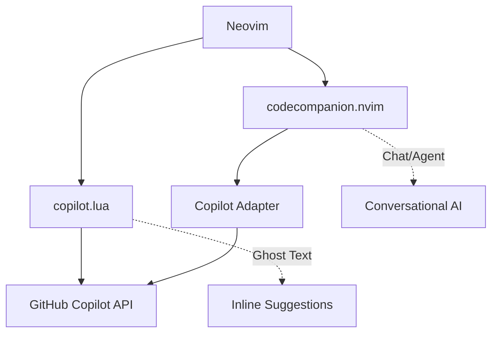
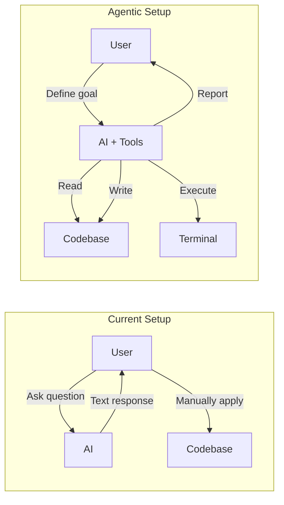

# AI Agentic Capabilities Guide

This document explains your current AI setup, how to achieve agentic capabilities, and potential improvements.

---

## 1. Current Architecture

Your AI stack consists of two complementary tools:



### 1.1 copilot.lua — Inline Suggestions
Handles **ghost text** completions directly in the buffer.

| Setting | Value | Purpose |
|:--------|:------|:--------|
| `auto_trigger` | `true` | Proactive suggestions |
| `accept` | `<C-a>` | Accept full suggestion |
| `next/prev` | `<M-]>/<M-[>` | Cycle alternatives |
| `dismiss` | `<C-]>` | Reject suggestion |

### 1.2 codecompanion.nvim — Chat & Actions
Provides **conversational AI** and **code actions** using the Copilot backend.

| Keymap | Action |
|:-------|:-------|
| `<leader>ccc` | Toggle Chat Window |
| `<leader>cca` | Open Actions Menu |

All three strategies (`chat`, `inline`, `agent`) are configured to use the `copilot` adapter.

---

## 2. What Are "Agentic" Capabilities?

> [!NOTE]
> **Agentic AI** = AI that can take *autonomous actions* on your codebase, not just generate text.

Traditional AI (your current setup):
- **Input**: You ask a question → **Output**: AI responds with text
- **Limited**: You manually copy/paste code suggestions

Agentic AI:
- **Input**: You give a goal → **Output**: AI reads files, writes code, runs commands
- **Autonomous**: The AI operates with "tools" that let it modify your environment

### 2.1 Key Agentic Features

| Feature | Description | Current Support |
|:--------|:------------|:----------------|
| **File Read/Write** | AI can read context and write changes | ⚠️ Partial (via inline edits) |
| **Multi-file Edits** | AI edits multiple files in one action | ❌ Not configured |
| **Command Execution** | AI runs shell commands (tests, linting) | ❌ Not configured |
| **MCP Integration** | Model Context Protocol for external tools | ❌ Not configured |
| **Retrieval/RAG** | Search codebase semantically | ❌ Not configured |

---

## 3. Enabling Agentic Capabilities

### 3.1 CodeCompanion Tools (Built-in)

CodeCompanion has built-in "tools" that are **enabled by default**. You access them via `@mention` syntax in the chat buffer.

> [!NOTE]
> Tools are configured under `interactions.chat.tools`, NOT inside `strategies.chat`.

```lua
-- Optional: Configure tool behavior (tools are already enabled by default!)
require("codecompanion").setup({
  interactions = {
    chat = {
      tools = {
        opts = {
          auto_submit_errors = true,   -- Send errors back to LLM automatically
          auto_submit_success = true,  -- Send success output back automatically
        },
        -- Require approval before running commands (safety)
        ["cmd_runner"] = {
          opts = {
            require_approval_before = true,
          },
        },
      },
    },
  },
  strategies = {
    chat = { adapter = "copilot" },
    inline = { adapter = "copilot" },
    agent = { adapter = "copilot" },
  },
})
```

### 3.2 Available Tools

CodeCompanion provides these tools out of the box:

| Tool | What It Does |
|:-----|:-------------|
| `@editor` | Read/write buffer content |
| `@files` | Read files from the filesystem |
| `@cmd_runner` | Execute shell commands |
| `@rag` | Semantic search (requires vector store) |

**Usage in Chat**:
```
@files Read all files in lua/plugins/ and summarize them
@cmd_runner Run `luacheck lua/` and fix any errors
@editor Replace the current function with an optimized version
```

### 3.3 Agent Slash Commands

Agents are predefined personas with specific tools enabled:

```lua
-- Add to codecompanion setup
agents = {
  ["full_stack"] = {
    description = "Full access to read, write, and execute",
    tools = { "@editor", "@files", "@cmd_runner" },
  },
  ["researcher"] = {
    description = "Read-only access for exploration",
    tools = { "@files", "@rag" },
  },
},
```

Use in chat with: `/full_stack` or `/researcher`

---

## 4. MCP (Model Context Protocol) Integration

> [!IMPORTANT]
> MCP is the emerging standard for connecting AI to external tools and data sources.

### 4.1 What MCP Enables

- **Generic Tool Interface**: Any MCP-compatible server becomes an AI tool
- **Context Providers**: Feed the AI with database schemas, API docs, etc.
- **Cross-Editor**: Same MCP servers work with VSCode, Neovim, etc.

### 4.2 Configuring MCP in CodeCompanion

```lua
-- Hypothetical future configuration
require("codecompanion").setup({
  mcp = {
    servers = {
      -- Example: File system server
      {
        name = "filesystem",
        command = "npx",
        args = { "-y", "@modelcontextprotocol/server-filesystem", "/path/to/project" },
      },
      -- Example: Git server
      {
        name = "git",
        command = "npx", 
        args = { "-y", "@modelcontextprotocol/server-git" },
      },
    },
  },
})
```

> [!WARNING]
> MCP support in CodeCompanion is still evolving. Check the plugin's latest documentation for current capabilities.

---

## 5. Potential Improvements

### 5.1 Immediate Wins (Low Effort)

| Improvement | Benefit | Implementation |
|:------------|:--------|:---------------|
| **Enable Built-in Tools** | Basic agentic editing | Add `tools = { enabled = true }` |
| **Visual Selection Actions** | Send code to AI with context | Already works with `<leader>cca` in visual mode |
| **Prompt Library** | Reusable prompts for common tasks | Add `prompts = {}` to config |

### 5.2 Medium-Term Enhancements

#### A. Custom Prompts/Slash Commands
```lua
prompts = {
  ["refactor"] = {
    description = "Refactor selected code",
    strategy = "inline",
    prompts = {
      {
        role = "user",
        content = "Refactor this code to be more idiomatic: ${selection}",
      },
    },
  },
  ["document"] = {
    description = "Add documentation",
    strategy = "inline", 
    prompts = {
      {
        role = "user",
        content = "Add comprehensive JSDoc/docstrings to: ${selection}",
      },
    },
  },
},
```

#### B. Context-Aware Buffers
Send the current file + related files automatically:
```lua
strategies = {
  chat = {
    adapter = "copilot",
    variables = {
      ["buffer"] = { enabled = true },
      ["lsp"] = { enabled = true },  -- Include LSP diagnostics
    },
  },
},
```

#### C. Keybinding Streamlining
Replace `<leader>ccc` with something faster:
```lua
{ "<leader>a", "<cmd>CodeCompanionChat Toggle<cr>", desc = "AI: Chat" },
{ "<leader>A", "<cmd>CodeCompanionActions<cr>", desc = "AI: Actions" },
```

### 5.3 Advanced (High Effort, High Reward)

#### A. RAG (Retrieval Augmented Generation)
Semantic search over your codebase for better context:
```lua
-- Requires a vector store (e.g., local Chroma/Qdrant)
tools = {
  rag = {
    enabled = true,
    provider = "chroma",
    connection = "http://localhost:8000",
  },
},
```

#### B. Custom Tool Creation
Build your own tools for specific workflows:
```lua
tools = {
  ["test_runner"] = {
    description = "Run tests for the current file",
    fn = function()
      local file = vim.fn.expand("%:p")
      return vim.fn.system("npm test -- " .. file)
    end,
  },
},
```

#### C. Multi-Agent Workflows
Chain multiple agents for complex tasks:
```
/researcher Analyze the codebase architecture
/full_stack Implement the suggested improvements
/researcher Review the changes for issues
```

---

## 6. Comparison: Current vs. Agentic



---

## 7. Recommended Reading

- [CodeCompanion Documentation](https://github.com/olimorris/codecompanion.nvim)
- [Model Context Protocol Spec](https://modelcontextprotocol.io/)
- [Copilot.lua GitHub](https://github.com/zbirenbaum/copilot.lua)

---

## 8. Quick Reference Card

### Current Keymaps
| Key | Action |
|:----|:-------|
| `<C-a>` | Accept Copilot suggestion |
| `<C-]>` | Dismiss suggestion |
| `<M-]>` / `<M-[>` | Next/Prev suggestion |
| `<leader>ccc` | Toggle AI Chat |
| `<leader>cca` | AI Actions Menu |

### Recommended Additions
| Key | Action |
|:----|:-------|
| `<leader>a` | Quick Chat Toggle |
| `<leader>A` | Actions Menu |
| `<leader>ac` | Chat with Context |
| `<leader>ar` | Run Agent Command |
